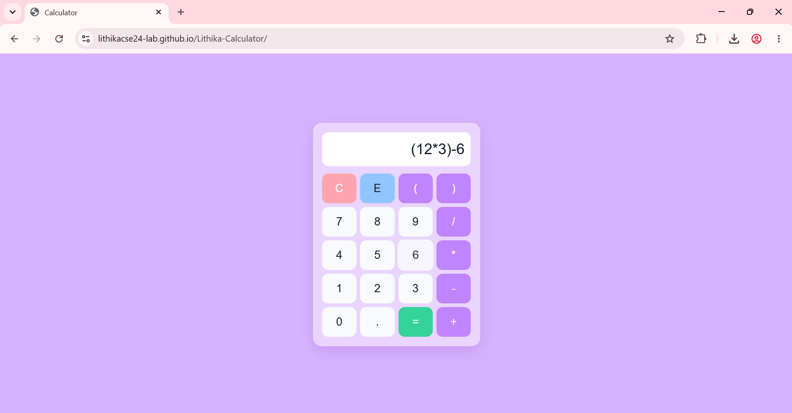

# 🧮 Calculator Web App

- A fully responsive calculator application developed using HTML, CSS, and JavaScript.
- It supports standard arithmetic operations, bracketed expressions, and keyboard interactions, with a clean and intuitive user interface.
---
## 🌐 Live Demo
🔗 **Try the app here:** https://lithikacse24-lab.github.io/Lithika-Calculator/
> **Deployment:** Hosted using **GitHub Pages**
---
## ✨ Features
- Basic arithmetic operations: `+`, `-`, `*`, `/`
- Parentheses support `( )` for complex expressions
- Decimal point support
- Clear (`C`) and Backspace (`E`) functionality
- Full keyboard support:
  - Numbers: `0–9`
  - Operators: `+ - * /`
  - Enter or = → Calculate result
  - Backspace  → Delete last character
  - Escape Key → Clear display
- Responsive design (mobile + desktop)
- Clean and aesthetic UI
---
## 🛠️ Tech Stack
- HTML5
- CSS3
- JavaScript (Vanilla JS)
---
## 📂 Project Structure
```
calculator-app/
├── index.html
├── style.css
├── script.js
├── README.md
└── screenshots/
    ├── input.png
    └── output.png
```
---
## 📸 Preview
### Input

### Output


---
**⭐ If you found this project useful, please consider giving it a star on GitHub!**
